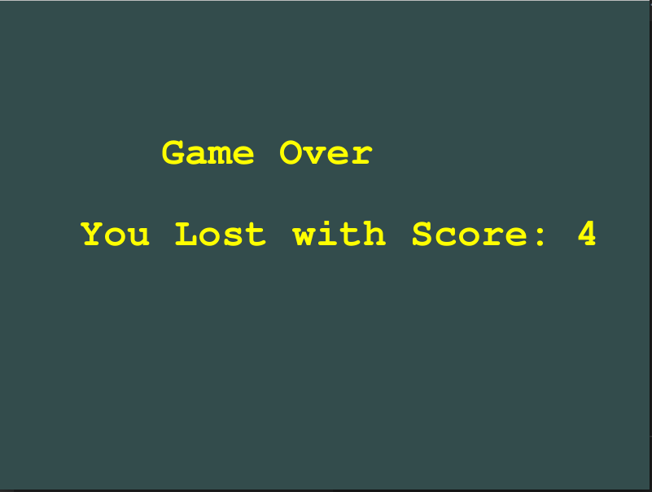

# Jetpack Joyride

---

### How to run the game

```
mkdir build 
cd build 
cmake ..
make 
./app
```
- A simple 2D game built using OpenGL library , and written in C++.
- Game consists of 3 levels , with each level the difficulty increases
  - the number of zappers
  - the speed of character
- the Obstacles (zappers) are randomly spawned and move in vertical direction with random speed

### **Objective**  : 
  - To escape the zappers while collecting maximum number of coins on the path.
  - The game ends after level 3 
  - Zappers and the jetlows glows when active

### **Controls**

1. Press <kbd>spacebar</kbd> to activate the jetpack,
propelling your character upwards.

2.  Releasing <kbd> spacebar</kbd> turns
the jetpack off and your character falls to the ground


# OpenGL boilerplate

## Contents
- glfw, glad and glm built from source in `libraries`

- Standard shader class from learnopengl.com and stb_image.h in `include`

- CMake file to compile project (includes glfw, glad, glm and freetype)


### Game Scenarios 




## Instructions to build

1. <b>INITAL SETUP</b> (do this once)

    - Setup FreeType to render text 
        - Linux/macOS (recommended OSes)
            - Download the latest stable release(2.10.1) from [the official website](https://freetype.org/download.html)
            - Run the following
                1.  `tar -xvf freetype-2.10.1.tar.gz`
                2.  `cd freetype-2.10.1`
                3.  `./configure --prefix=/usr/local/freetype/2_10_1 --enable-freetype-config` : Prefix defines where freetype is installed
                4.  `make; make install`
        - Windows
            - Use [this video](https://www.youtube.com/watch?v=qW_8Dyq2asc) if using VSCode (I hope you aren't)

2. `mkdir build; cd build`
3. `cmake ..; make`
4. `./app`
